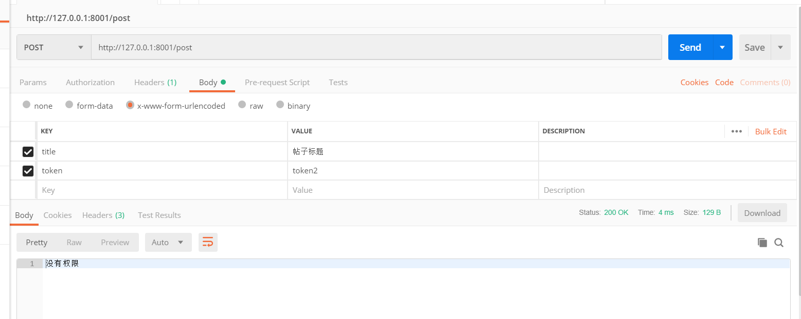

> 微服务架构最近非常的流行,我的公司年后也准备使用微服务架构.而且之前我也很想学习接触架构层面的知识,了解一些比较前沿的东西,所以利用这个假期来尝试学习一下微服务架构.
>
> 之前我已经了解了微服务大概是一个怎么样的东西,对于一些理论的东西并不打算写太多.个人觉得微服务的技术核心在于rpc和服务发现/注册;思想主要是不同业务之间的拆分
> 
> 我打算尝试使用golang和gRPC框架一步一步的去摸索,带着一些问题去实践

## RPC
RPC（Remote Procedure Call）—远程过程调用,简单来说就是,在A服务器上调用B服务器上的方法.rpc可以通过http协议但不仅限于来实现.大多rpc框架也会支持多种协议.利用rpc框架可以不让我们关注rpc实现层,让我们调用一个远程的方法就像在本地调用一样.

通常会将登录/注册(权限服务)拆分为一个微服务,当有一些操作(另外的微服务)需要验证某项权限时,可以通过rpc调用权限微服务上的方法来验证当前用户是否拥有权限.感觉像是通过rpc来将各个独立的微服务关联起来.

### [gRPC](https://grpc.io/about/)
[gRPC](https://grpc.io/about/)是google的一个跨语言的rpc框架.其实一开始是想用[rpcx](http://rpcx.site/)的,虽然中文文档挺齐全的,而且也是国人开发的,但是一搜索网上都没有什么资料,就暂时不了解了.

### protocol buffers
[protocol buffers](https://developers.google.com/protocol-buffers/docs/proto3)是一种轻便高效的结构化数据储存结构,这是gRPC默认的数据协议.我们也需要去了解一下它.

### 开始
先装好golang环境,获取包,先用官方提供给我们的例子试一试
```sh
# 安装grpc
go get -u google.golang.org/grpc
# 安装Protocol Buffers v3
go get -u github.com/golang/protobuf/protoc-gen-go
```

### 例子分析
我在 [client](../examples/rpc/helloworld/greeter_client/main.go),[server](../examples/rpc/helloworld/greeter_server/main.go)和[helloworld.pb.go](..examples/rpc/helloworld/helloworld/helloworld.pb.go)的源码中做了一些注释,方法都可以在官方文档中看到[grpc](https://godoc.org/google.golang.org/grpc)
```sh
# 将例子复制过来
cp -r $GOPATH/src/google.golang.org/grpc/examples examples/rpc
# 编译例子 server和client 然后运行
cd examples/rpc/helloworld
```
默认端口是50051,我竟然不能打开,好像是被占用了,我直接就换了一个,完成.

先运行服务端,然后运行客户端可以看到效果


helloworld.pb.go是通过的插件```protoc-gen-go```编译```helloworld.proto```生成的.虽然可以自动生成,但我还想了解一下实现的方法.然后还需要了解proto的语法,我们才能制作属于我们的rpc调用接口

### 定义接口

#### protoc
这里就不弄太复杂了,我们可以参照例子给我们的来写,来写一个简单的,就比如权限验证,通过token和接口名字获取该用户信息和是否有权限使用接口.
```sh
syntax = "proto3"; # 定义版本
package = lms; # 包名

service UserAuth { # 定义服务
  # 验证token(TokenMsg),然后返回用户信息(UserMsg)
  rpc isvalid(TokenMsg) returns (UserMsg) {}
}

message TokenMsg { # 消息模型
    string token = 1; # string 字符串类型 token 名字
    string api = 2;
}

message UserMsg {
  int32 uid = 1;
  bool access =2;
  string name = 3;
  string group = 4;
}
```
更复杂的消息结构还能嵌套,枚举,这里就先只用这一些

上面的服务定义是 单项RPC 的形式,调用完就没了,还有 服务端流式 RPC,客户端流式 RPC和客户端流式 RPC,具体的可以去看一下其他的文章[https://colobu.com/2017/04/06/dive-into-gRPC-streaming/](https://colobu.com/2017/04/06/dive-into-gRPC-streaming/),感觉通常单项RPC就可以了,其他的应该是在一些数据传输的场景使用.

#### 生成go文件
写好proto文件后,我们需要用工具编译成golang代码.windows需要去下载工具[https://github.com/protocolbuffers/protobuf/releases](https://github.com/protocolbuffers/protobuf/releases)
```sh
protoc -I ./proto --go_out=plugins=grpc:./proto ./proto/learnMicroService.proto
```

### 编写服务
继续参照给我们的例子写,具体代码看我源码吧 [auth 权限验证微服务](../auth/main.go)

这里我构建了一个权限验证的微服务,然后另外构建一个发帖的,可以去看我的源码 [post 帖子微服务](../post/main.go)

主要在发帖的时候判断是否拥有权限

```go
ctx, cancel := context.WithTimeout(context.Background(), time.Second)
defer cancel()
userMsg, err := authService.Isvalid(ctx, &micro.TokenMsg{
	Token: req.PostFormValue("token"),
	Api:   "post",
})
if err != nil {
	ret = "rpc调用错误"
} else if !userMsg.Access {
	ret = "没有权限"
} else {
	ret = userMsg.Name + "post 请求成功"
	posts = append(posts, req.PostFormValue("title"))
}
```

我用postman测试:



到这里,两个非常非常简陋的微服务算是完成了,一个权限验证,一个发帖hhhh
