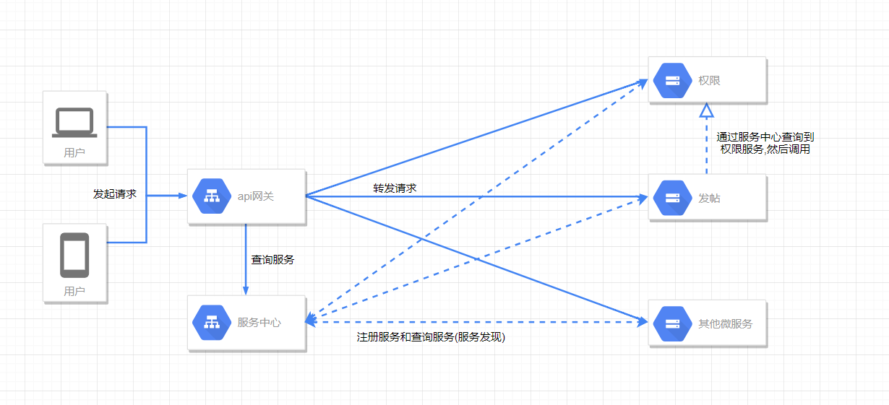
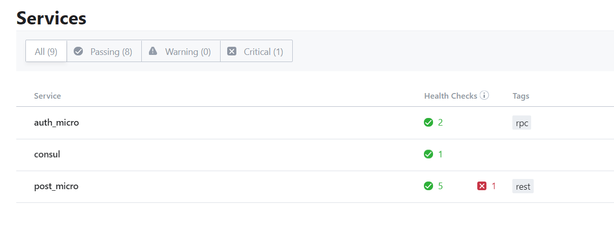
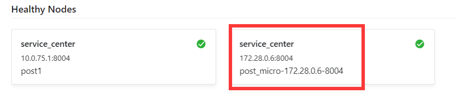

> 容器的好处就不多说了,一次构建到处运行.对于微服务来说,需要将各个微服务部署到多个主机上,而且所需要的环境还不一定相同,甚至冲突,那么容器就很好的解决了这个问题,容器所占用的资源比虚拟机小多了.而且容器部署起来很是方便.然后go和docker也是很配的一对,go编译之后可以直接的放入容器中运行,而不需要依赖环境.
> 
> 这一节的话我们还需要在代码里面种加入服务发现和注册的功能,以便在容器中能够动态扩容.    



## 服务注册
先获取开发包
```sh
go get -u github.com/hashicorp/consul
# 其实好像不要-u...我习惯加上然后帮我编译了...
```
我另外封装了一下,可以去看我的代码[consul](../common/consul.go)

这里另外说一下,consul的tag,我们解析的时候可以带上tag

例如我这里的发帖微服务,一个是对外的restful,一个是内部的rpc,我们可以注册两个相同名字的服务,然后给他们打上tag,解析的时候tag可以放最前面,例如:restful.post_micro.service.consul

Demo:
```go
//注册服务
	rpcService := consul.Service{
		Name:    "auth_micro",
		Tags:    []string{"rpc"},
		Address: consul.LocalIP(),
		Port:    5000,
	}
	defer rpcService.Deregister()
    err = rpcService.Register()
    
//使用
	rpcService := consul.Service{
		Name: "auth_micro",
		Tags: []string{"rpc"},
	}
	rpcConn, err = rpcService.GetRPCService()
```

## Dockerfile
go的话我们可以多阶段构建,第一阶段编译,第二阶段运行,这样可以减小我们最终的镜像大小.我们可以先把golang的镜像pull下来```docker pull golang```然后基于这个镜像来编译,然后再吧编译好的放到第二阶段中运行,我们可以选择最小的alpine来运行

> 这里又遇到坑,我要获取一些被墙了的包...然而我容器里面又没有工具...后面只好再装一个镜像来折腾了,然而不支持google.golang.org...只能git clone了,我有点遭不住,为了做好这个镜像,还用了个奇淫巧技...在后面加入```;exit 0```防止报错停止构建

emmmm上面放弃了,git clone下来还有些依赖,依赖又需要去clone,太复杂了,然后我灵机一动...好像可以直接用我的代理...真香...
```sh
ENV HTTP_PROXY=http://10.0.75.1:1080/ \
    HTTPS_PROXY=http://10.0.75.1:1080/ 
```

折腾了挺久....算是吧dockerfile写好了,然后在docker-compose里面添加两个服务,post端口暴露出来,我就可以直接试试能不能访问了
```yml
    post_1:
        image: post:latest
        container_name: micro_post_micro_1
        ports: 
            - 8004:8004
        networks: 
            - micro

    auth_1:
        image: auth:latest
        container_name: micro_auth_microo_1
        networks: 
            - micro
```



直接运行compose,一次成功,很是欣慰



右边那个就是我们容器中运行的了,有一个报错的,没有自动清理掉,consul好像不能自动清理,可以在健康监测那里添加一个```DeregisterCriticalServiceAfter```参数,到期删除,不知道能不能设置一个比较短的时间,然后每隔一段时间就重新注册一次服务,刷新有效期这样达到自动清理的效果

到这里的时候我们已经可以将我们的微服务集群动态扩容了,但是还缺少很多东西这一节就到这里了....然后还需要用到数据库重写一下服务,或者选一个web框架,后面还有难点要整.