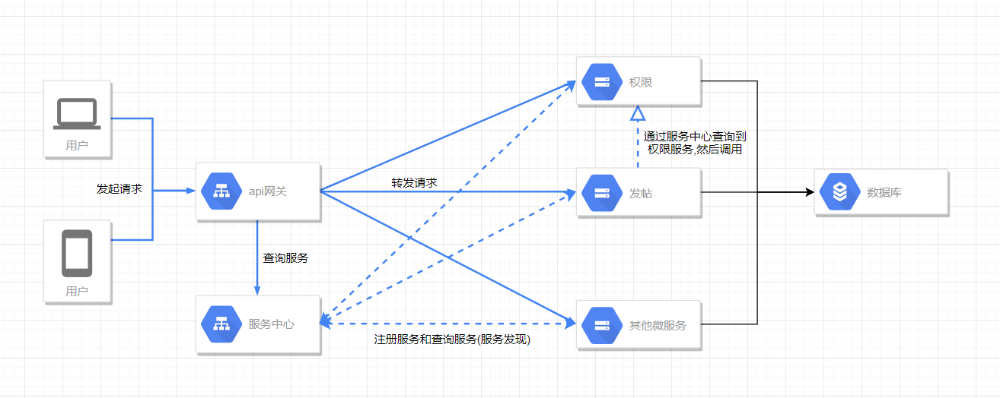
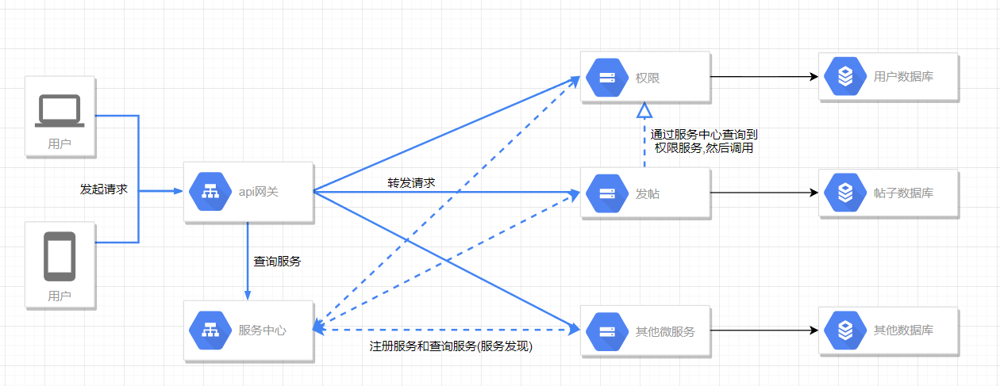
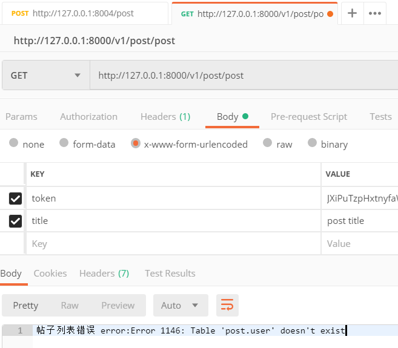

> 原本打算是用k8s的,但是这么一弄感觉越来越往运维方向走了.现在的网关和服务中心已经够用了.所以只写了一部分,作为附录,如果以后有时间会继续填坑.
> 
> 这一节的话,主要是数据库拆分和我们之前分开的两个微服务(权限和发帖)接上数据库(主要是代码).

## 未拆分前


未拆分前,我们的架构大概是这样的,所有的微服务从同一个数据库中请求,这样的好处是简单,但是微服务之间的关系又觉得没有区分开来,微服务架构的一个非常明显的功能就是一个服务所拥有的数据只能通过这个服务的API来访问.

## 拆分后


拆分后大概是上图这样,一个微服务对应一个数据库,这样更容易微服务的扩展,而且微服务的独立性更强,其中一个数据库蹦了之后也不会互相影响.看起来是有点像分库分表,拆分后的好处明显,但是带来的困难也很明显.分布式事务,跨服务查询等等一些问题.后面就要去解决这些问题.

在本地,我使用compose搭建了两个容器来模拟这种情况
```yaml
    post_db:
        image: mysql
        hostname: post_db
        container_name: micro_post_db
        environment: 
            - MYSQL_USER=post
            - MYSQL_ROOT_PASSWORD=micro_db_pwd
            - MYSQL_DATABASE=post
        ports: 
            - 3308:3306
        networks: 
            - micro

    auth_db:
        image: mysql
        hostname: auth_db
        container_name: micro_auth_db
        environment: 
            - MYSQL_USER=auth
            - MYSQL_ROOT_PASSWORD=micro_db_pwd
            - MYSQL_DATABASE=auth
        ports: 
            - 3307:3306
        networks: 
            - micro
```
名字也能看出一个是帖子的数据库一个是用户的数据库,然后在代码中,数据库连接那里的ip要更改成对应的```hostname```.
```golang
//连接数据库
err = db.Connect("127.0.0.1", 3306, "root", "", "test")
//查询帖子列表
rows, err := db.Query("select a.id,b.user,a.title from posts as a join user as b on a.uid=b.uid")
```
之前是使用的本地ip,不过更改完后,我们的帖子服务中的GET请求获取帖子列表是无法使用的.因为用到了join查询用户表中的用户名,现在我们已经将数据库拆分开来了,物理上帖子数据库中是没有用户数据的.然后报出如下错误


这一节主要就是将代码进行了修改使用了数据库,然后用compose搭建了两个数据库.后面几节将解决拆分分库之后出现的一些问题.