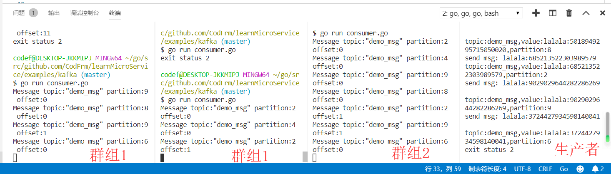
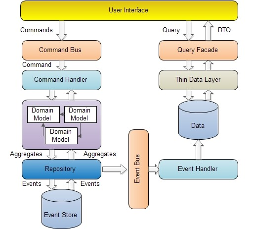

> 微服务架构中,每个微服务所拥有的数据对当前微服务来说是私有的,只能通过其提供的 API 进行访问.我们需要实现业务的事务在多个服务之间保持一致性,还有就是不同服务中数据的数据聚合.
> 
> 最终我选择了尝试领域驱动设计和CQRS,可以从git看到我对本节有不少改变=_=,尝试一下,希望不要误人子弟,对于理论的知识我也不会在本文中写太多,我会贴我觉得不错的一些文章.

## 方案
这一节将来探究不同的微服务之间,不同服务中数据的数据聚合.我将列出几种方法.

### 字段冗余
这一种方法是在查询的表中增加一些字段存储另外一些表的数据,这种方法实现起来比较方便,但是需要改变表结构,而且如果所需要的字段比较多,这又会出现不少问题.

### 业务中合并
通过调用所需要的微服务接口得到数据,使用代码将数据合并起来,达到join的效果.这种方法虽然对数据库没有什么影响,而且也符合微服务的思想,但是性能损耗过大.

### 数据库FEDERATED引擎
MySQL数据库能够使用FEDERATED引擎映射所需要的表,有点像复制但并不是的,然后可以使用join查询达到我们想要的效果.这个也许是一个不错的解决方案,但是不符合我们微服务的设计思想,不易于独立交付,对方微服务表结构修改之后可能会出现问题.

### 共享数据库
将需要join的数据表放在同一个数据库上,其余的还是作为独立的数据库.感觉优缺点和上面差不多.

### CQRS架构
命令查询的责任分离Command Query Responsibility Segregation (简称CQRS)模式是一种架构体系模式，能够使改变模型的状态的命令和模型状态的查询实现分离。这是微服务跨数据库查询的一个比较流行的解决方案,具体怎么样我也不细说了,怕误人子弟

### 事件驱动架构(EDA)
CQRS使用了EDA的思想,所以感觉起来非常的相似,CQRS的C可以是同步实现,也可以为异步.EDA则是异步,也没有Event Store的要求.

## CQRS+DDD(领域驱动设计)

### DDD
对于领域驱动设计,我觉得不要去考虑数据库,当做数据库不存在去创建我们的模型,不然很难脱离原来的设计方式.应该是数据库来迎合我们,而不是去迎合数据库.

然后对于领域模型存储到数据库中可以使用一个中间件转换,而不是将sql写在领域模型中.

实体和值对象:
> 引用于:[https://www.cnblogs.com/youxin/archive/2013/05/25/3099175.html](https://www.cnblogs.com/youxin/archive/2013/05/25/3099175.html)
* 实体核心是用唯一的标识符来定义，而不是通过属性来定义。即即使属性完全相同也可能是两个不同的对象。同时实体本身有状态的，实体又演进的生命周期，实体本身会体现出相关的业务行为，业务行为会实体属性或状态造成影响和改变。
* 值对象Value Object，它用于描述领域的某个方面本身没有概念标识的对象，值对象被实例化后只是提供值或叫设计元素，我们只关心这些设计元素是什么？而不关心这些设计元素是谁。书里面谈到颜色，数字是常见的值对象。这种对象无状态，本身不产生行为，不存在生命周期演进。

### 思路
> 之前我认为是使用CQRS维护物化视图,实际我们所维护的物化视图就是我们的数据库(因为之前我认为物化视图只是展示给用户看的一个表,数据库中还需要在原来的表中存储一次数据),我的思想还是停留在迎合数据库上,虽然这看上去并没有什么区别.

我现在的思路是这样的(现在我们的发帖和权限两个微服务来说),使用kafka作为消息中间件,发布事件.

这个版本,我加入一个积分的微服务,当发送一条帖子时,增加积分.这只是一个小功能,我偷懒的将它和认证服务放在了一起.

用户改名的时候发布一条user_update_msg消息,然后订阅这个消息,修改用户名.(我认为如果在业务中用户名是不允许修改的话,可以将其作为值对象,如果允许修改且要随之变化的话,应该将用户作为一个实体,也需要实现这一消息)

~~然后关于发帖或者回帖时发布一个post_msg/post_reply_msg消息,对于这个看上去感觉是没有必要发送消息的,让系统变得更复杂,我们可以直接的同步操作数据.不过加入事件也有好处,假设当我们再加入一个积分微服务的时候,我们就不需要再改代码了,直接订阅该消息.~~

我放弃了回帖功能- -...改为积分功能,积分微服务订阅事件,进行处理

如果之前的数据迁移的话,我想的是创建数据库的时候,使用微服务api(或者直接将数据复制过来进行操作),在代码中聚合数据,按照符合现在结构的方式插入,不知道这是不是一个可行的方法.

这一切都是一个菜鸡的尝试...如果不正确希望能够得到指教.

## 实现

### kafka
> Event Store和MQ我们使用Kafka,虽然用Kafka作为事件溯源不一定是好的,但是它能用啊.

依旧使用docker来搭建我们的环境,由于Kafka的基于集群的高可用特性是建基于Zookeeper（称zk）之上的,因此构建可用的Kafka镜像,是需要依赖于zk基础的.
```yaml
    zookeeper:
        image: wurstmeister/zookeeper
        hostname: zookeeper
        container_name: micro_zookeeper
        ports:
            - 2181:2181
        networks: 
            - micro

    kafka:
        image: wurstmeister/kafka
        hostname: kafka_mq
        container_name: micro_kafka_mq
        environment: 
            - KAFKA_ADVERTISED_HOST_NAME=10.0.75.1
            - KAFKA_ZOOKEEPER_CONNECT=zookeeper:2181
        ports:
            - 9092:9092
        networks: 
            - micro

    kafka_manager:
        image: sheepkiller/kafka-manager
        container_name: micro_kafka_manager
        depends_on:
            - zookeeper
        environment:
            - ZK_HOSTS=zookeeper
        ports:  
            - 9000:9000
        networks: 
            - micro
```
9000端口是kafka的一个web管理,后来感觉不好用...可以考虑去掉,我用了一个桌面的程序,kafka tools

kafka还有挺多概念的,这里的话我就不细说了.我在examples下写了一个demo,大家可以去看看,效果如下,大概模拟的多个微服务(群组1和群组2为两个微服务)消费一条事件(不能重复消费,然后分布到不同的微服务实例上)


### CQRS


我创建了一个ddd的目录,里面包括了下面这些文件夹:
* commands 命令事件以及命令处理(图中的Command Bus和Command Handler)
* events 领域事件和事件处理器
* domain 领域模型(放置聚合根之类)
* repository 领域模型持久化仓库
* services 领域服务

command由user interface(Controller之类的)生成然后分配到command bus,然后由command bus分配给command handler处理,之后给domain services处理业务逻辑

我们将原来的代码进行大量修改,主要是之前服务注册,连接数据库什么的都一股脑写在了main函数里面....现在我们进行了一些分层,使用写配置的方式来启动,有些地方也可以使用IoC来进行解耦

现在启动方式变成了这样,docker和docker-compose也进行了修改,其中有对postgres数据库进行了一些修改(主要是因为windows10下的docker有个bug,不能持久化数据)
```sh
go run auth #启动auth微服务
go run post #启动post微服务
```
