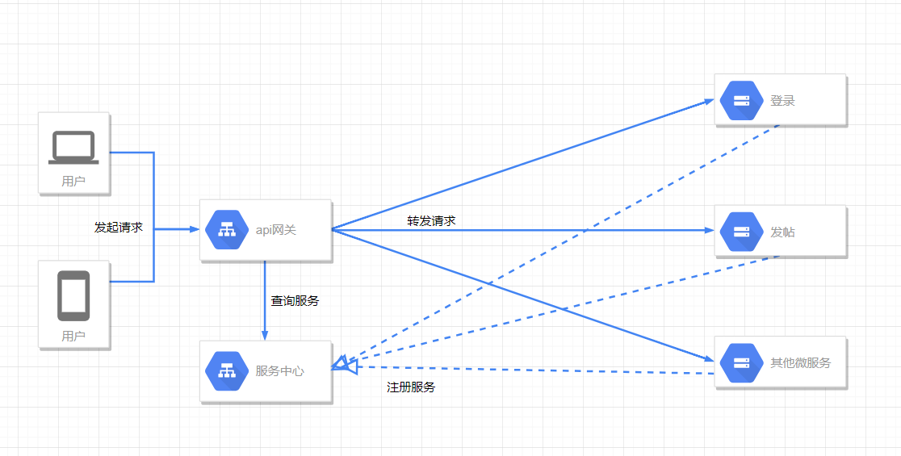
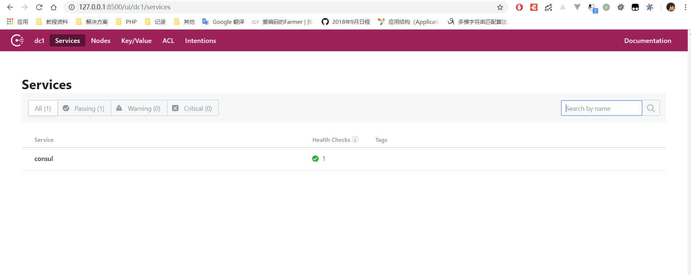
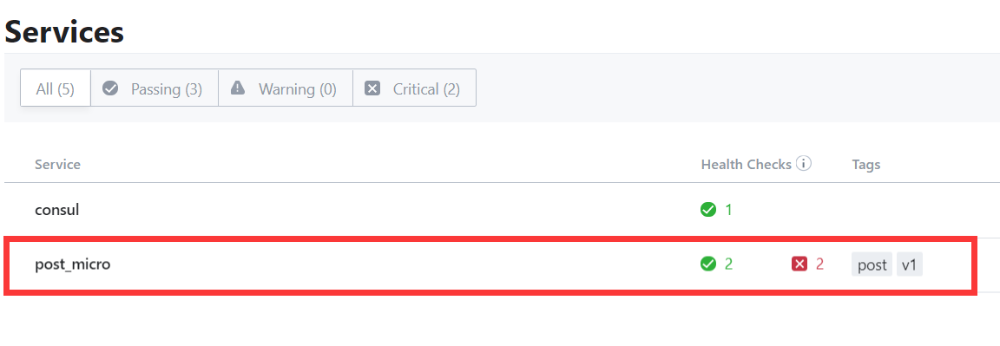
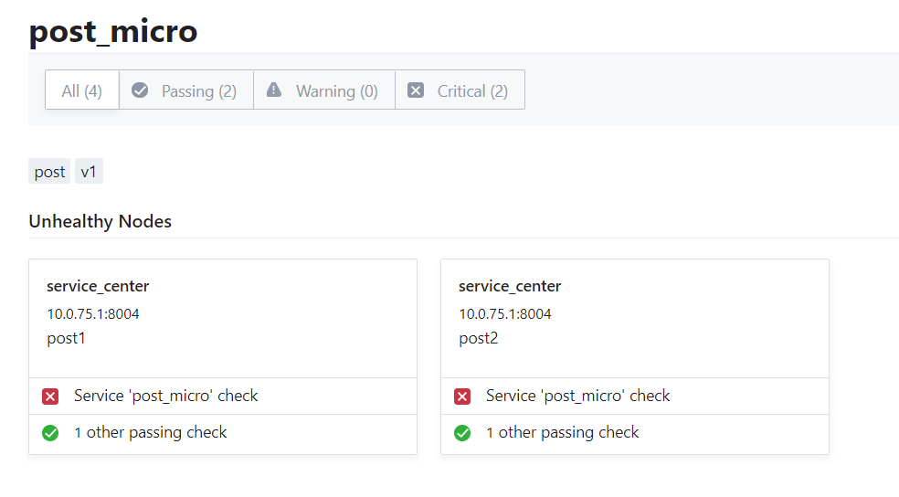
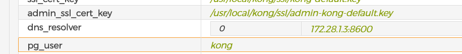
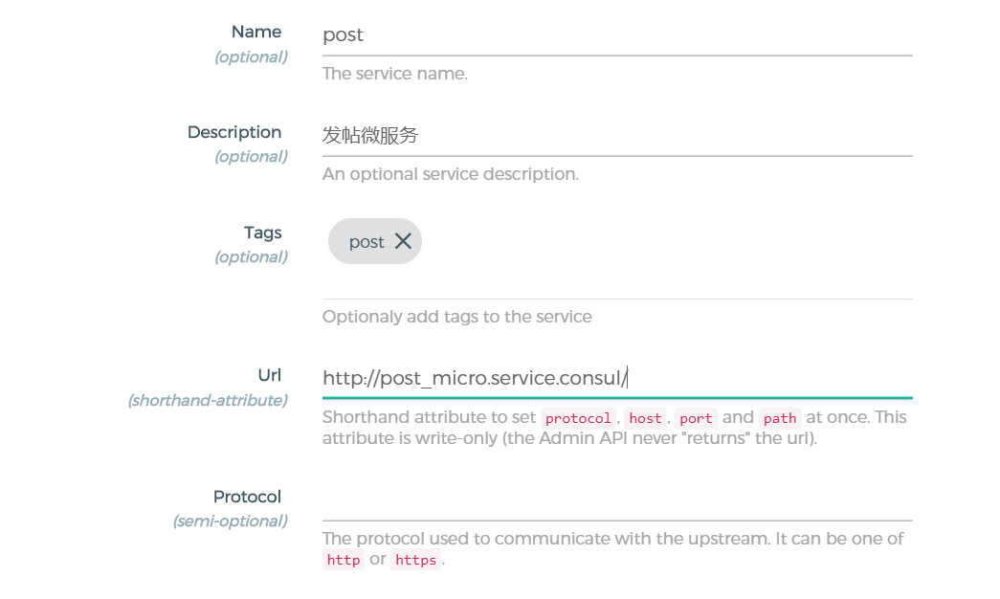
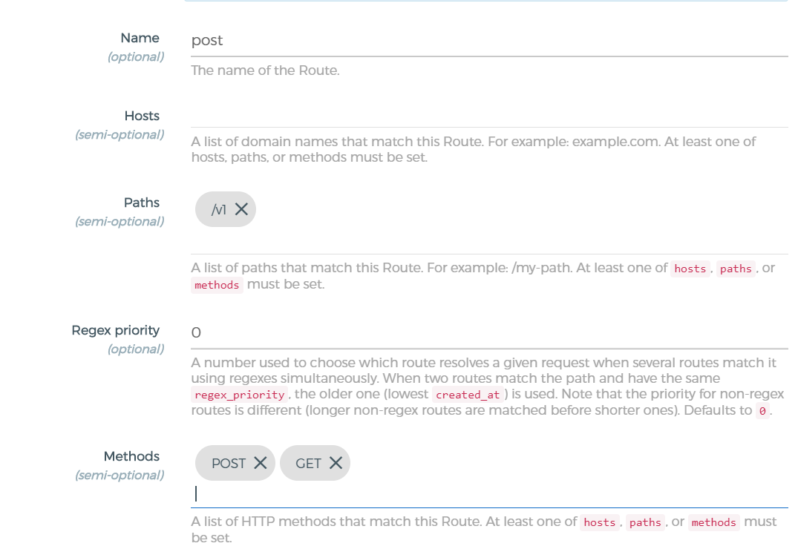
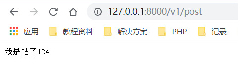

> 上一节完成了api网关,这一节来了解微服务架构中的服务发现
> 
> 我们现在的微服务rpc调用我们是直接的填入的ip和端口,客户端连接服务端.但是当我们的微服务多起来,而且是集群部署那么问题就出来了,我们不可能每一个都填好ip和端口,这样是不方便动态扩容和部署的,而且当我们调用的时候也无法做到很好的负载均衡.关于这个有两种模式,客户端服务发现和服务端服务发现,这里我们只探讨服务端服务发现
> 
> 那么我们就需要一个服务中心,微服务进程创建的时候告诉他,我能提供xx服务,我的ip端口是xx,然后其他的微服务或客户需要调用的时候来服务中心问,我需要xx服务的信息就OK了



服务发现的框架常见的有
* zookeeper
* eureka
* etcd
* consul

这里我们选择[Consul](https://www.consul.io/)来实现

## 开始
> 自然和之前一样,继续用我们的docker

docker-compose.yml中直接加入如下,然后访问 8500端口就可以进入面板了
```yml
    service_center:
        image: consul
        hostname: service_center
        container_name: micro_service_center
        ports: 
            - 8500:8500
            - 8600:8600
            - 8300:8300
        networks: 
            - micro
```



## 使用

### 服务注册/发现
[https://www.consul.io/api/agent/service.html#register-service](https://www.consul.io/api/agent/service.html#register-service)

服务注册使用api,发送请求,这里我用postman先来测试添加

官网给了一个例子
```json
PUT /agent/service/register json

{
  "ID": "redis1",# 服务id
  "Name": "redis",# 服务名
  "Tags": [# 标签
    "primary",
    "v1"
  ],
  "Address": "127.0.0.1",# 服务地址
  "Port": 8000,# 服务端口
  "Meta": {# 服务的一些信息
    "redis_version": "4.0"#表示redis版本
  },
  "EnableTagOverride": false,# 是否开启Tag覆盖,更多细节请参考:https://www.consul.io/docs/agent/services.html#enable-tag-override-and-anti-entropy 我也看不太懂啊,hhh
  "Check": {# 校验规则
    "DeregisterCriticalServiceAfter": "90m",
    "Args": ["/usr/local/bin/check_redis.py"],
    "HTTP": "http://localhost:5000/health",
    "Interval": "10s",
    "TTL": "15s"
  },
  "Weights": {# 权重,应该是用于负载均衡的
    "Passing": 10,
    "Warning": 1
  }
}
```
我先尝试自己添加几个服务,然后我的面板上就有了一个新的**post_micro**服务,点进去,虽然都挂了emmmm因为我现在还没开启





```sh
curl -X PUT \
  http://127.0.0.1:8500/v1/agent/service/register \
  -H 'Content-Type: application/json' \
  -H 'Postman-Token: b2089dbe-8ad3-487b-97e0-25217e6ee346' \
  -H 'cache-control: no-cache' \
  -d '{
    "ID": "post2",
    "Name": "post_micro",
    "Tags": [
        "post",
        "v1"
    ],
    "Address": "10.0.75.1",
    "Port": 8004,
    "Check": {
        "DeregisterCriticalServiceAfter": "90m",
        "HTTP": "http://10.0.75.1:8004/post",
        "Interval": "10s"
    }
}'
```

然后consul也提供了服务发现(查询)的接口,来试一试,除了这种接口的方式外,还可以使用DNS,我们只要如果配合kong的话需要用这种形式,等下介绍.post_micro就是我们的服务名了
```sh
curl -X GET \
  http://127.0.0.1:8500/v1/catalog/service/post_micro \
  -H 'Postman-Token: ce54bd1d-c21e-46e0-ae0e-0230de9e6f8d' \
  -H 'cache-control: no-cache'
```

域名默认格式为 servicename.service.consul
```sh
/ # dig @127.0.0.1 -p 8600 post_micro.service.consul SRV

; <<>> DiG 9.11.5 <<>> @127.0.0.1 -p 8600 post_micro.service.consul SRV
; (1 server found)
;; global options: +cmd
;; Got answer:
;; ->>HEADER<<- opcode: QUERY, status: NOERROR, id: 25596
;; flags: qr aa rd; QUERY: 1, ANSWER: 2, AUTHORITY: 0, ADDITIONAL: 5
;; WARNING: recursion requested but not available

;; OPT PSEUDOSECTION:
; EDNS: version: 0, flags:; udp: 4096
;; QUESTION SECTION:
;post_micro.service.consul.     IN      SRV

;; ANSWER SECTION:
post_micro.service.consul. 0    IN      SRV     1 1 8005 0a004b01.addr.dc1.consul.
post_micro.service.consul. 0    IN      SRV     1 1 8004 0a004b01.addr.dc1.consul.

;; ADDITIONAL SECTION:
0a004b01.addr.dc1.consul. 0     IN      A       10.0.75.1
service_center.node.dc1.consul. 0 IN    TXT     "consul-network-segment="
0a004b01.addr.dc1.consul. 0     IN      A       10.0.75.1
service_center.node.dc1.consul. 0 IN    TXT     "consul-network-segment="

;; Query time: 0 msec
;; SERVER: 127.0.0.1#8600(127.0.0.1)
;; WHEN: Wed Jan 30 05:02:21 UTC 2019
;; MSG SIZE  rcvd: 266
```

因为kong要用consul的dns,整合起来,然后到这里的时候遇到个坑...首先需要ip地址,不能是hostname了...然后我是在docker里面...还需要docker-compose静态ip,可以看我的compose文件的变化,然后设置了一个```KONG_DNS_RESOLVER```参数,但还不行,因为你的dns变了,```KONG_PG_HOST```之前是hostname,现在我的dns不能解析,所以也要给数据库设置一个静态ip(设置静态ip主要是防止变化后不能使用).之前的容器最好down掉,network也删除,重新来一遍

成功之后在konga面板的info中可以看到dns_resolver是我们设置的值了



### 接入网关
然后和前一节一样,添加service,因为我重新构建了,所以之前的数据是没了的,也没关系,重新来





有没有发现我前面是添加了两个不同的端口,然后这里没有添加端口了,是的,consul帮你自动匹配了,负载均衡了解一下,你就当我这俩是集群好了,效果的话,我故意的文件改了一下,刷新出来的页面不同(我只是为了演示效果,实际是绝对不行的...)




## End
这一节感觉还不算完全完成,注册和发现的代码我们还没写呢


留到下一节好了,今天几乎是配置了一天的环境,下一节预计就要开始容器化微服务了,然后等下吧文章搬到博客去,之前没直接放博客的原因主要是怕半途弃坑,多丢人,2333

[http://blog.icodef.com/](http://blog.icodef.com/)