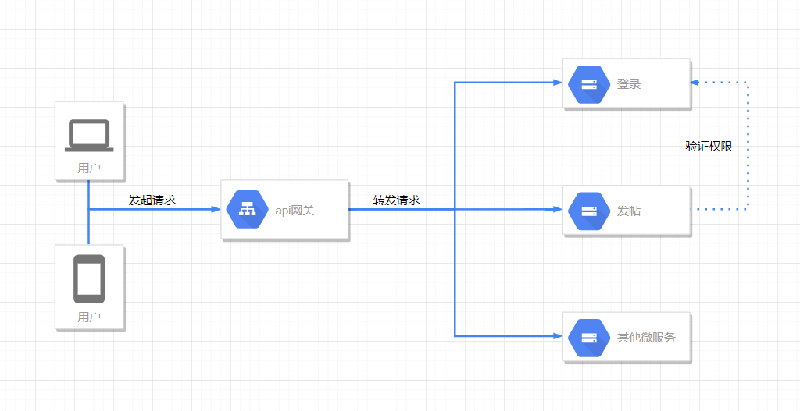
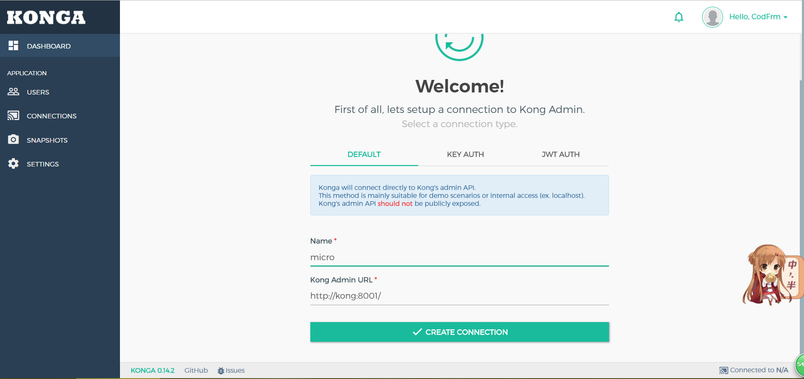
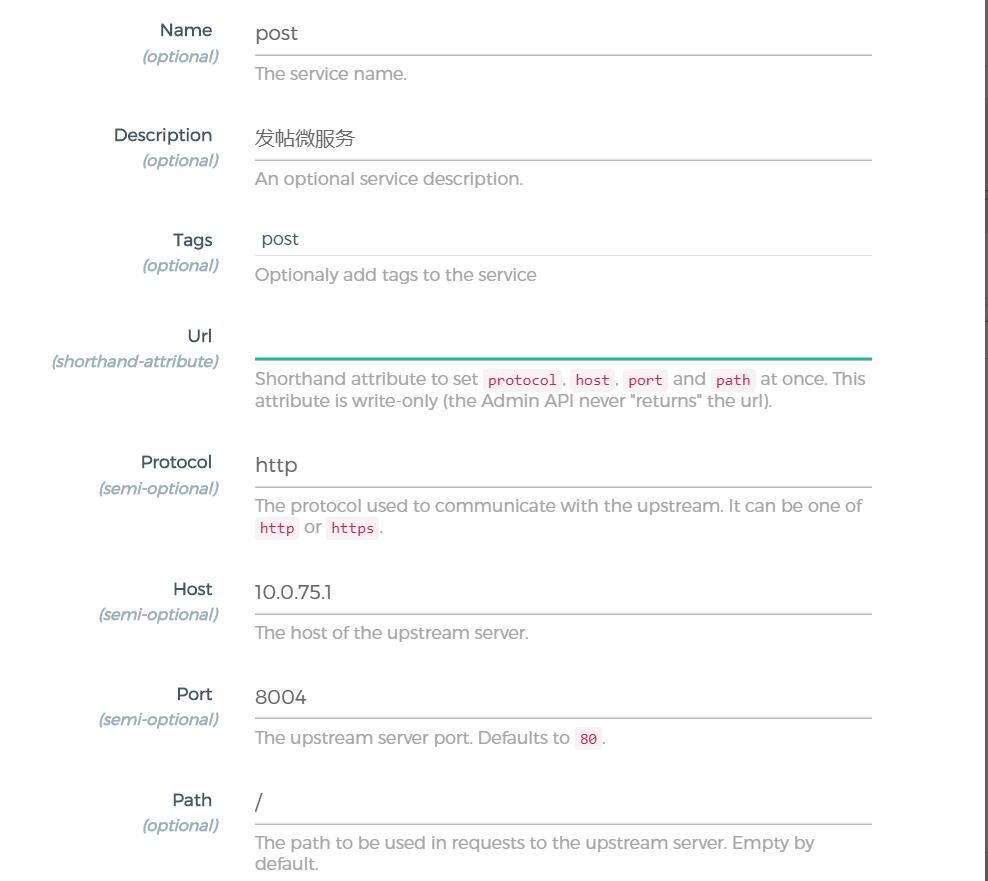
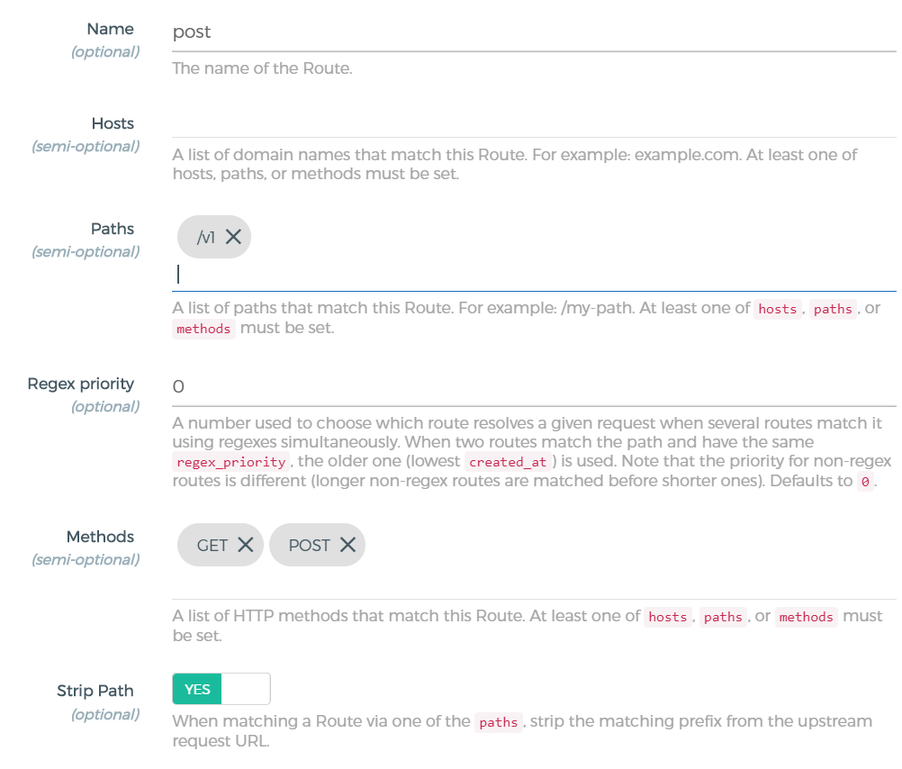
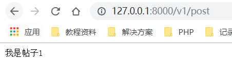

> 上一节学习了rpc框架,现在有一个问题,拆开是拆开了,但是不同的服务直接对外都会提供不同的接口,上一节我只简略的为帖子服务写了接口,现在我用户要登录获取token了,我就得给他一个登录的接口,我现在是同一台电脑上,80端口被帖子微服务占用了,我登录微服务难道要开81端口给用户服务?当然是不可能的,这时候就要用api网关了,当然api网关可不止这一个功能,授权、监控、负载均衡、缓存等都能通过api网关实现.
> 
> 通过同一个入口,然后根据api的路径访问不同的微服务.顺便尝试自己做了张图,emm感觉很差,当我们这一节结束后,我们的架构大概就是下面这样了,就像是对外一个统一的接口.



API网关有很多选择,这里列举几个:[Tyk](https://tyk.io/),[Kong](https://konghq.com/),[zuul](https://github.com/Netflix/zuul)等

这里我选择了Kong来布置我的网关.

## 开始
> 我本地当然是选择Docker安装,感觉Docker是真的方便,就算在Docker中弄错了也可以删过重来,不像在物理机上,弄错了万一还删错了东西,系统崩溃T_T各种毛病,而且清理起来也很方便

其实我尝试了几次....第一次用的Tyk然后发现需要收费,系统还蜜汁登陆不进去,然后就换了Kong,然后又遇到了一个大坑,安装的版本是1.0.2,我Google搜索到推荐的面板是```kong dashboard```结果这个很长没维护了,好不容易安装好了,结果最高只支持0.15版本=_=,只怪当初没仔细看这些吧....我还以为这个是官方维护的项目,然后又搜到了一个面板```konga```,终于折腾好了,效果如下.



注册一个账号,然后填好参数之后就可以进去了.

### 安装
搭建请使用Docker,我已经将docker-compose写好了,直接在项目根目录执行:
```docker-compose up```就可以了

参考文档:
* [konga 面板](https://github.com/pantsel/konga/blob/master/README.md)
* [kong docker安装](https://docs.konghq.com/install/docker/?_ga=2.219796185.1115565600.1548736826-1002927840.1548736826)
* [konga 文档](https://pantsel.github.io/konga/)


api网关默认地址:[http://127.0.0.1:8000/](:http://127.0.0.1:8000/),不过现在还没添加api,返回的是```{"message":"no Route matched with those values"}```

面板默认地址:[http://127.0.0.1:1337/](http://127.0.0.1:1337/)

### 使用
点击到```SERVICE```中,添加一个新的服务,我把我上一节的帖子服务加入进去,如图



后面的默认就行,Url可以为空,如果写的话可以写:http://10.0.75.1:8004/,添加后其实会自动分解成下面的选项(这里帖子服务的端口和我kong admin 的端口冲突了,所以我改成了8004)

10.0.75.1 是我主机的ip地址(在docker中)

service(服务)在这里的概念可以对应我们的微服务,将我们微服务暴露的接口通过上面的步骤添加进去,配置中的upstream server(上游服务)就是我们微服务的一些ip信息,协议那里是http或https,不过kong 1.0 好像已经开始支持gRPC了,还没去研究.

添加完服务之后,到service里去查看,然后添加route



主要是paths和methods,paths是匹配的路径,我这里写的/v1,methods允许GET和POST



浏览器输入[http://127.0.0.1:8000/v1/post](http://127.0.0.1:8000/v1/post)成功得到结果

kong还有很多强大的功能,还可以计费,也有丰富的插件,不过暂时我还用不到,先到这里,下一节预计开始研究 服务注册/发现