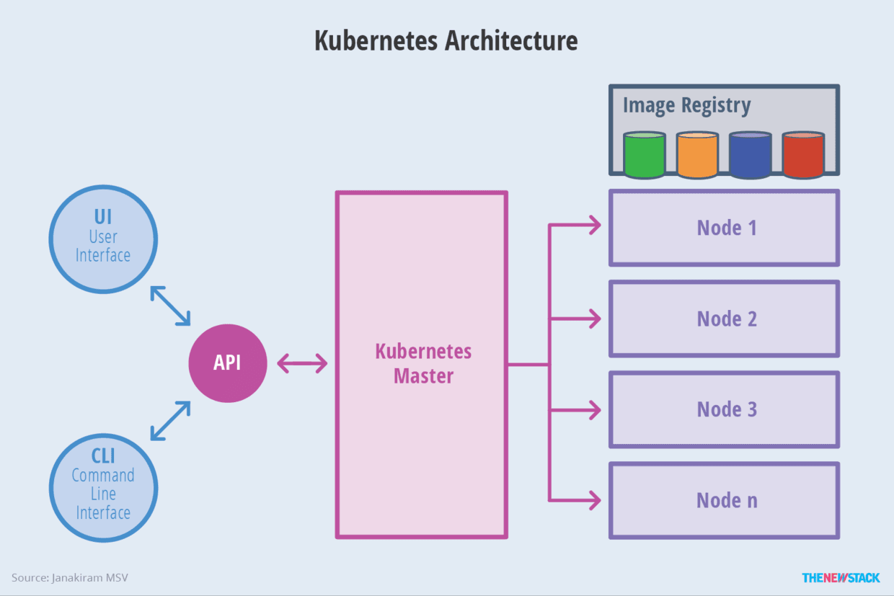
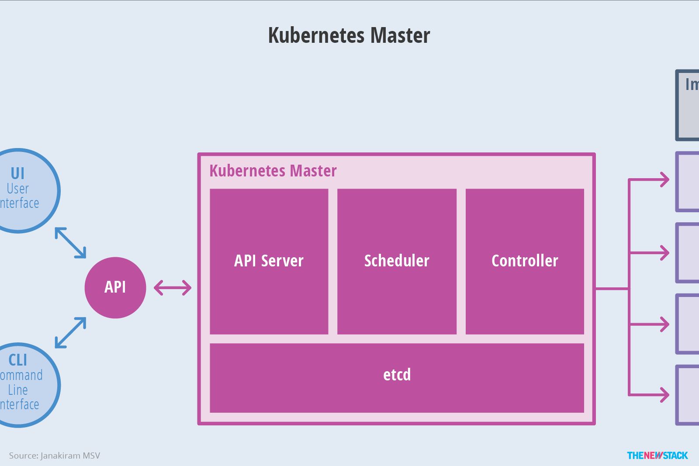
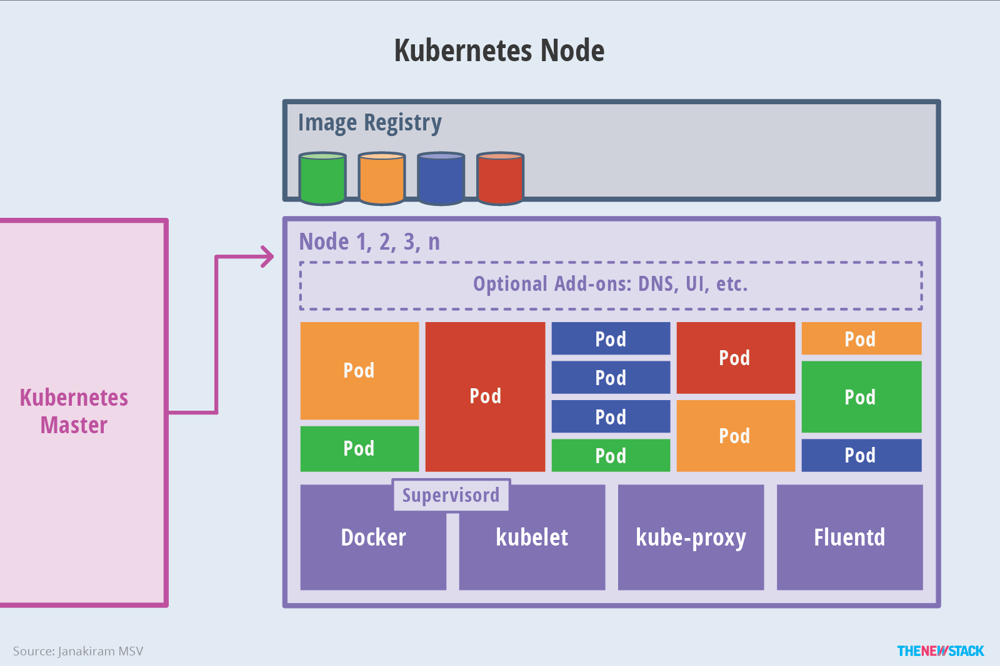
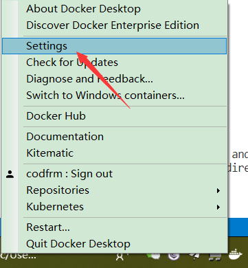
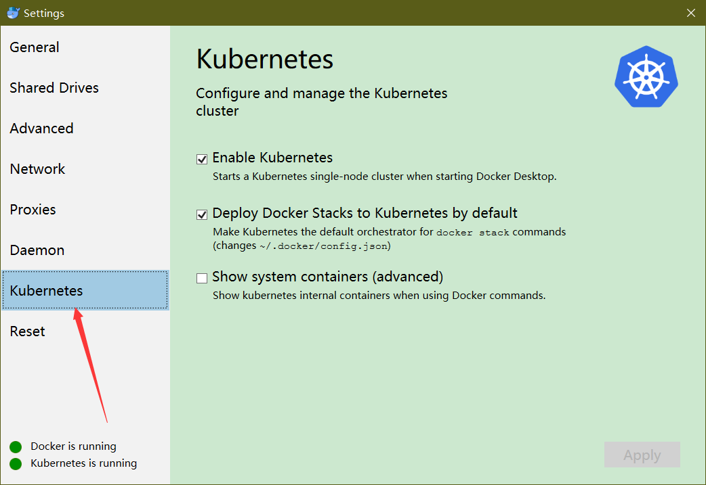
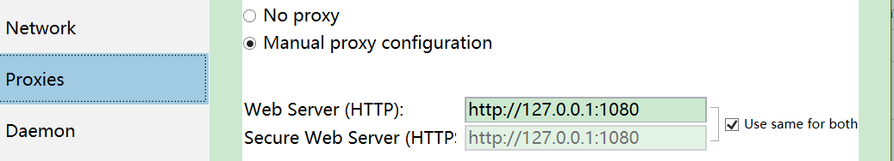
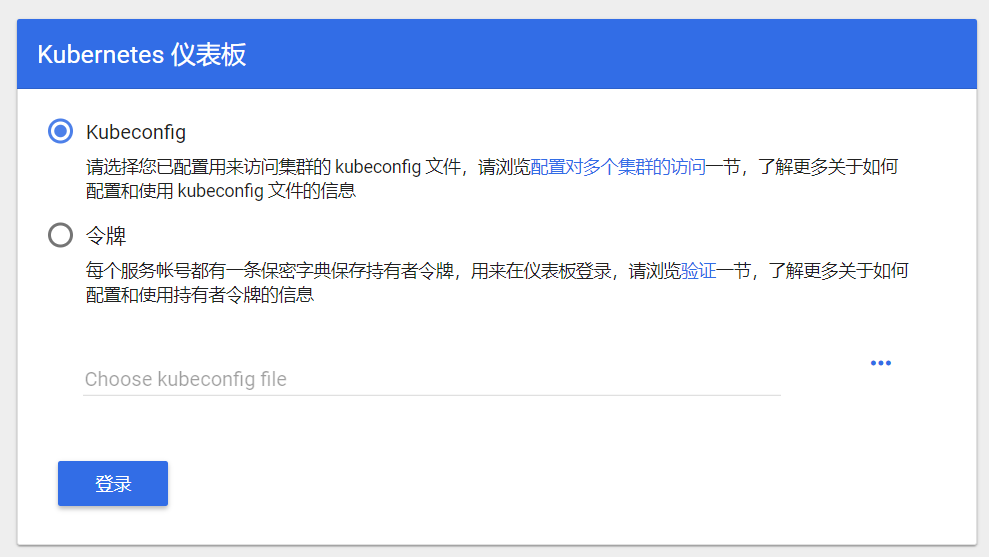
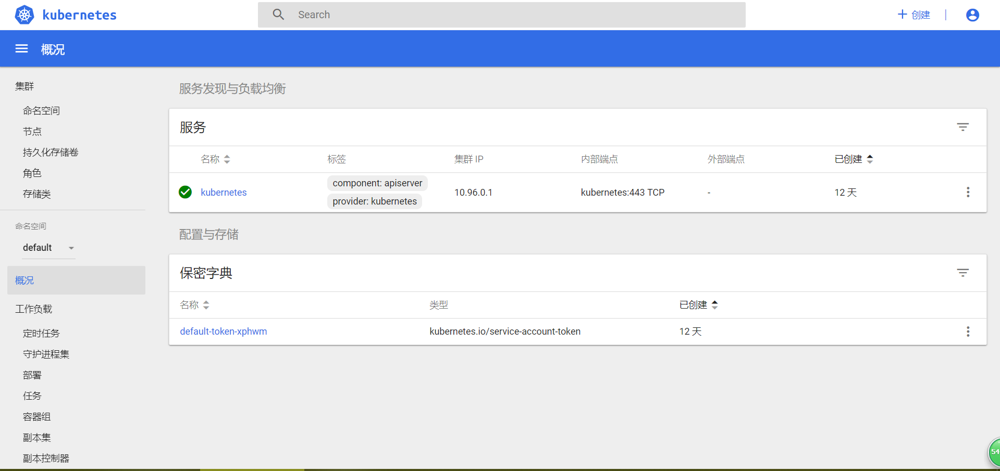

> Kubernetes(k8s)是用于自动部署、扩展和管理容器化应用程序的开源系统。该系统由Google设计并捐赠给Cloud Native Computing Foundation来使用。 它旨在提供“跨主机集群的自动部署、扩展以及运行应用程序容器的平台”。 它支持一系列容器工具, 包括Docker等。
> 
> 到现在其实对k8s的理解还有点混乱,通过搭建和运行之后,渐渐的有一点开朗了.感觉都要变成运维了...

## k8s 架构


k8s整体架构


k8s Master架构


k8s Node架构
## 安装k8s
笔者系统为windows,所以只列出windows下的安装步骤(Mac)相同.



打开docker desktop设置



勾选项,然后Apply应用



### **注意!**

这里如果你有科学上网,建议设置一下代理,Proxies那里,这里我遇到的坑是:不勾选代理,龟速下载,镜像比较多比较大.然后用镜像源的话,我也试过,忘记是什么问题了,很久很久都没有完成.

### 运行面板
然后当右边的那个k8s is run 变成绿色就代表成功了,在命令行中运行下面命令,开启面板

[k8s 面板官方文档](https://kubernetes.io/docs/tasks/access-application-cluster/web-ui-dashboard/)
```sh
kubectl create -f https://raw.githubusercontent.com/kubernetes/dashboard/master/aio/deploy/recommended/kubernetes-dashboard.yaml

kubectl proxy
```
然后访问这个链接:[http://localhost:8001/api/v1/namespaces/kube-system/services/https:kubernetes-dashboard:/proxy/](http://localhost:8001/api/v1/namespaces/kube-system/services/https:kubernetes-dashboard:/proxy/)这个面板只能通过执行这个命令的主机访问



成功之后就是这样的,然后我们还需要令牌...[https://github.com/kubernetes/dashboard/wiki/Creating-sample-user](https://github.com/kubernetes/dashboard/wiki/Creating-sample-user)官方给出的例子,也可以跟着我下面的一起来

创建一个dashboard-adminuser.yaml文件,内容如下,我放在我项目目录的```kubernetes```文件夹中,```kind```属于服务账号类,name是```admin-user```管理员用户,```namespace```是```kube-system```表示是系统应用

```yaml
apiVersion: v1
kind: ServiceAccount
metadata:
  name: admin-user
  namespace: kube-system
```
然后输入命令```kubectl apply -f dashboard-adminuser.yaml```

文档后面的可以选择不进行,如果你想的话可以google去查一下,我这里简单的写一下,大概是给用户授权的意思,我只是写出来了,没有用,不确定正确蛤2333
创建一个adminuser-rbac.yaml
```yaml
apiVersion: rbac.authorization.k8s.io/v1
kind: ClusterRoleBinding
metadata:
  name: admin-user
roleRef:
  apiGroup: rbac.authorization.k8s.io
  kind: ClusterRole
  name: cluster-admin
subjects:
- kind: ServiceAccount
  name: admin-user
  namespace: kube-system
```
执行命令:```kubectl apply -f adminuser-rbac.yaml```

然后执行```kubectl -n kube-system describe secret $(kubectl -n kube-system get secret | grep admin-user | awk '{print $1}')```获取Token,再将token复制到网页令牌那里去,就可以进入面板了



中文,舒服 ╮(‵▽′)╭

## Kong部署
我们可以将Kong作为Kubernetes的Ingress,[Kong Ingress Controller](https://github.com/Kong/kubernetes-ingress-controller#get-started)

```sh
kubectl apply -f https://bit.ly/kong-ingress
```

